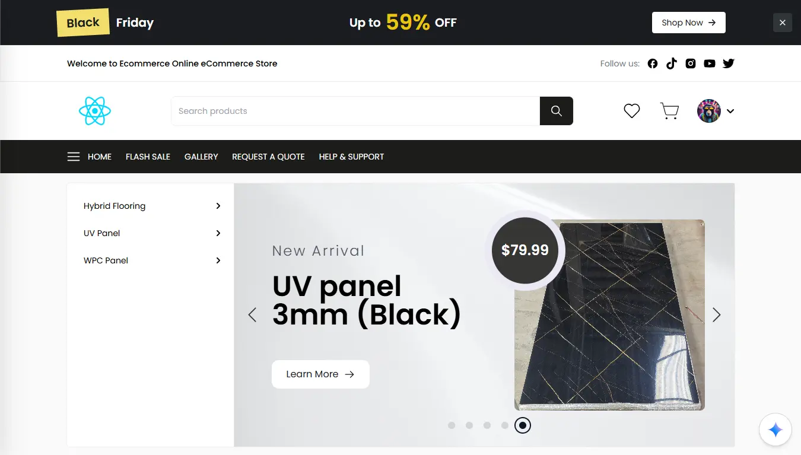

## Overview

A multi-tenant e-commerce solution designed to host multiple client-branded storefronts within a single architecture.  
The platform serves three roles — **Admin**, **Client**, and **Customer** — allowing centralized management while enabling brand-specific experiences for each client.  
Clients can launch their stores on **wildcard subdomains** (e.g., `client.example.com`) or on custom domains.

---

## Functionality

- Client onboarding with admin approval  
- Storefront customization (branding, colors, logos)  
- Product management and reseller pricing control  
- Operational modes:
  - **Quote-only mode** – disables direct purchasing while allowing quote requests  
  - **Full e-commerce mode** – enables checkout and payments  

---

---

## Technical Highlights

- **Payment Processing:** Stripe + direct bank transfer support  
- **Responsive Design:** Tailwind CSS for mobile-first adaptability  
- **State Management & Data Fetching:** Redux Toolkit + TanStack Query  
- **Additional Tools:** Axios, Formik, Yup, React Router, and more  

---

## Outcomes

This project demonstrates the ability to scale a single codebase to support multiple independently branded e-commerce sites, with flexible deployment options and admin-driven configuration.
